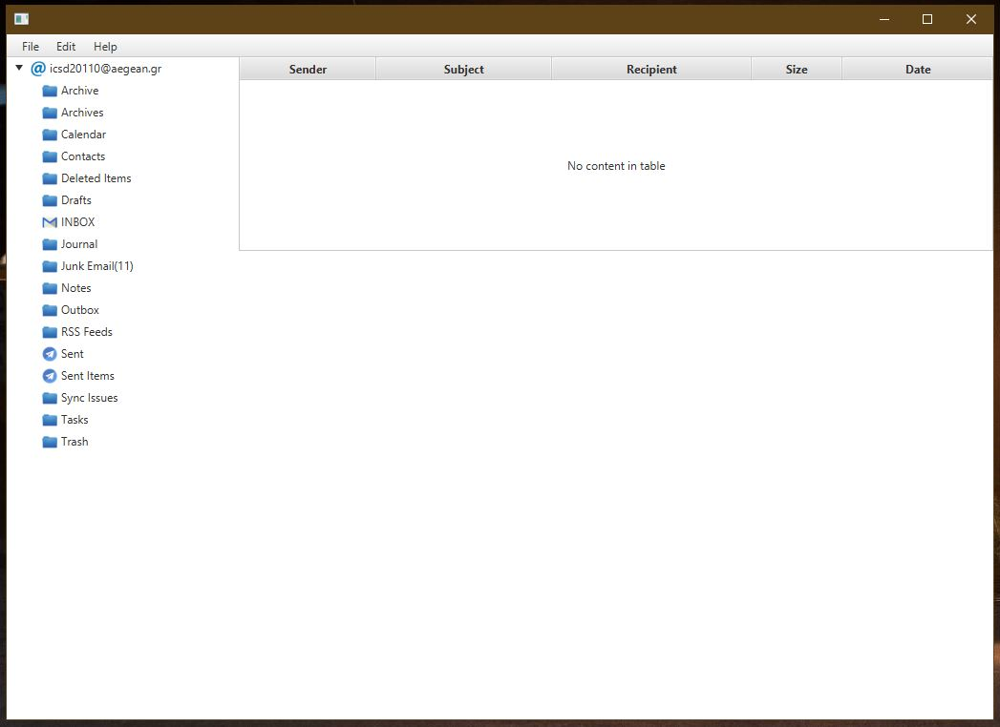

---

# 👨‍💻 Email Desktop App 🤩

---

## 💖 Information about the App 😀

The following application is developed using JavaFX. The app is very simple and has the basic functionality that an email app will need. At this moment, you cannot use an account from Google or Yahoo because they don't allow third-party apps to use their accounts.

---

## 😮 Key Features of the App 😎

The app has a lot of nice features like the following:

- **Display all types of messages:** You can view various types of messages including Archive, Contacts, INBOX, Junk Email, etc.

- **Customizable Themes:** You have the option to change the theme to black or light, depending on your preference.

- **Adjustable Font Size and Window Resizing:** You can customize the font size of the app and resize the window according to your needs.

- **Compose and Send Emails:** The app allows you to compose emails and send them seamlessly.

---

## 💯 Screenshots of the app 😁

    

---

    

---

    

---

    

---

    

---

    

---
